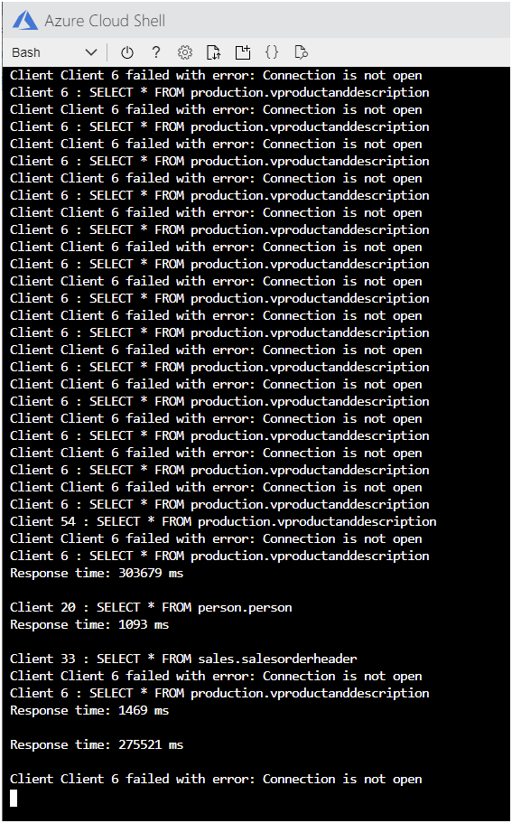
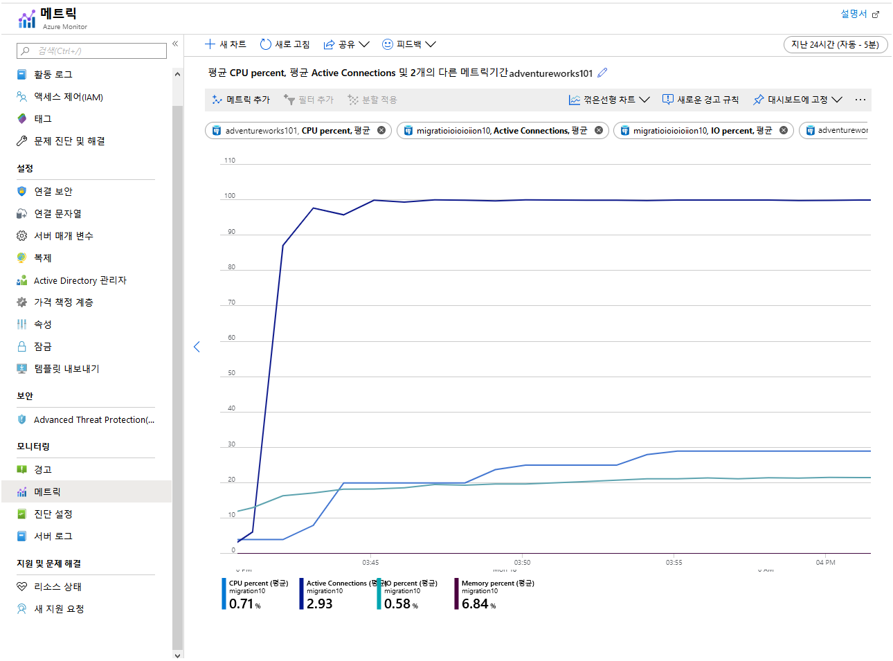

---
lab:
    title: '마이그레이션된 데이터베이스 모니터링 및 튜닝'
    module: '모듈 4: 보호, 모니터링 및 튜닝'
---

# 랩: 마이그레이션된 데이터베이스 모니터링 및 튜닝

## 개요

이 랩에서는 이 모듈에서 파악한 정보를 토대로 이전에 마이그레이션한 데이터베이스를 모니터링하고 튜닝합니다. 구체적으로 설명하자면, 데이터베이스에서 읽기 워크로드를 매우 많이 생성하는 샘플 애플리케이션을 실행한 다음 Azure에서 제공되는 메트릭을 사용하여 결과를 모니터링합니다. 또한 쿼리 저장소를 사용하여 쿼리의 성능을 검사하며, 읽기 복제본을 구성하여 일부 클라이언트의 읽기 처리를 복제본으로 오프로드합니다. 그런 후에는 이 변경으로 인해 성능이 어떻게 변화했는지 살펴봅니다.

## 목표

이 랩을 완료하면 다음 작업을 수행할 수 있습니다.

1. Azure 메트릭을 사용하여 성능 모니터링
2. 쿼리 저장소를 사용하여 쿼리의 성능 검사
3. 일부 사용자의 읽기 작업을 읽기 복제본을 사용하도록 오프로드
4. 성능을 다시 모니터링하여 결과 평가

## 시나리오

여러분은 AdventureWorks라는 조직에서 데이터베이스 개발자로 근무하고 있습니다. AdventureWorks는 10년 이상 최종 소비자 및 유통업체에 자전거와 자전거 부품을 직접 판매해 왔습니다. AdventureWorks의 시스템은 이전에 Azure Database for PostgreSQL로 마이그레이션한 데이터베이스에 정보를 저장합니다.

마이그레이션을 수행한 후 시스템의 정상 작동을 보증해야 합니다. 그래서 사용 가능한 Azure 도구를 사용해 서버를 모니터링하기로 합니다. 그리고 경합 및 대기 시간으로 인해 응답 시간이 길어질 가능성을 줄이기 위해 읽기 복제를 구현하기로 합니다. 결과 시스템을 모니터링하여 결과를 Single Server 아키텍처와 비교해야 합니다.

## 설정

이 랩에서는 모듈 3의 랩을 완료했다고 가정합니다. 이 랩은 해당 랩에서 만든 데이터베이스 및 Azure Database for PostgreSQL 서버를 사용합니다. 해당 랩을 완료하지 않은 경우 아래의 설정 단계를 수행하세요. Azure Database for PostgreSQL 서버가 작동 중이며 이 서버로 AdventureWorks 데이터베이스를 올바르게 마이그레이션했다면 연습 1을 바로 진행하세요.

1. 수업용으로 실행 중인 **LON-DEV-01** 가상 머신에 로그인합니다. 사용자 이름은 **azureuser** 이고 암호는 **Pa55w.rd** 입니다.

2. 브라우저를 사용하여 Azure Portal에 로그인합니다.

3. Azure Cloud Shell 창을 엽니다. **Bash** 셸을 실행 중인지 확인합니다.

4. Cloud Shell에서 스크립트와 샘플 데이터베이스가 포함되어 있는 리포지토리를 아직 복제하지 않았으면 복제합니다.

```bash
git clone https://github.com/MicrosoftLearning/DP-070-Migrate-Open-Source-Workloads-to-Azure ~/workshop
```

5. *workshop/migration_samples/setup/postgresql* 폴더로 이동합니다.

```bash
cd ~/workshop/migration_samples/setup/postgresql
```

6. 다음 명령을 실행합니다. *[nnn]* 은 스크립트에서 생성된 Azure Database for PostgreSQL 서버의 이름을 고유하게 지정하는 숫자로 바꿉니다. 스크립트에 두 번째 매개 변수로 지정하는 Azure 리소스 그룹에 서버가 생성됩니다. 이 리소스 그룹은 아직 없는 경우 자동으로 생성됩니다. 필요에 따라 리소스 그룹의 위치를 세 번째 매개 변수로 지정합니다. 매개 변수를 생략하는 경우 이 위치는 "westus"로 기본 설정됩니다.

```bash
bash copy_adventureworks.sh adventureworks[nnn] [resource_group_name] [location]
```

7. *awadmin* 암호를 입력하라는 메시지가 표시되면 **Pa55w.rdDemo** 를 입력합니다.

8. *azureuser* 암호를 입력하라는 메시지가 표시되면 **Pa55w.rd** 를 입력합니다.

9. 계속하기 전에 스크립트가 완료될 때까지 기다립니다. 스크립트가 완료되려면 5~10분 정도 걸리며, 완료 시에는 **Setup Complete** 메시지가 표시됩니다.

## 연습 1: Azure 메트릭을 사용하여 성능 모니터링

이 연습에서는 다음 태스크를 수행합니다.

1. Azure Database for PostgreSQL 서비스에 대해 Azure 메트릭 구성
2. 데이터베이스를 쿼리하는 여러 사용자를 시뮬레이션하는 샘플 애플리케이션 실행
3. 메트릭 확인

### 태스크 1: Azure Database for PostgreSQL 서비스에 대해 Azure 메트릭 구성

1. 수업용으로 실행 중인 **LON-DEV-01** 가상 머신에 **azureuser** 사용자(암호: **Pa55w.rd**)로 로그인합니다.

2. 웹 브라우저를 사용하여 Azure Portal에 로그인합니다.

3. Azure Portal에서 Azure Database for PostgreSQL 서비스의 페이지로 이동합니다.

4. **모니터링** 아래에서 **메트릭** 을 클릭합니다.

5. 차트 페이지에서 다음 메트릭을 추가합니다.

    | 속성  | 값  |
    |---|---|
    | 리소스 | adventureworks[nnn] |
    | 메트릭 네임스페이스 | PostgreSQL 서버 표준 메트릭 |
    | 메트릭 | 활성 연결 |
    | 집계 | 평균 |

    이 메트릭은 1분마다 서버에 대해 설정된 평균 연결 수를 표시합니다.

6. **메트릭 추가** 를 클릭하고 다음 메트릭을 추가합니다.

    | 속성  | 값  |
    |---|---|
    | 리소스 | adventureworks[nnn] |
    | 메트릭 네임스페이스 | PostgreSQL 서버 표준 메트릭 |
    | 메트릭 | CPU 비율 |
    | 집계 | 평균 |

7. **메트릭 추가** 를 클릭하고 다음 메트릭을 추가합니다.

    | 속성  | 값  |
    |---|---|
    | 리소스 | adventureworks[nnn] |
    | 메트릭 네임스페이스 | PostgreSQL 서버 표준 메트릭 |
    | 메트릭 | 메모리 비율 |
    | 집계 | 평균 |

8. **메트릭 추가** 를 클릭하고 다음 메트릭을 추가합니다.

    | 속성  | 값  |
    |---|---|
    | 리소스 | adventureworks[nnn] |
    | 메트릭 네임스페이스 | PostgreSQL 서버 표준 메트릭 |
    | 메트릭 | IO 비율 |
    | 집계 | 평균 |

    마지막 3개 메트릭은 테스트 애플리케이션에서 리소스를 사용하는 방식을 보여 줍니다.

9. 차트의 시간 범위를 **지난 30분** 으로 설정합니다.

10. **대시보드에 고정** 을 클릭한 다음 **현재 대시보드에 고정** 을 클릭합니다.

### 태스크 2: 데이터베이스를 쿼리하는 여러 사용자를 시뮬레이션하는 샘플 애플리케이션 실행

1. Azure Portal의 Azure Database for PostgreSQL 서버 페이지에서 **설정** 아래의 **연결 문자열** 을 클릭합니다. ADO.NET 연결 문자열을 클립보드에 복사합니다.

2. Azure Cloud Shell로 전환합니다. 스크립트와 샘플 데이터베이스가 포함되어 있는 리포지토리를 아직 복제하지 않았으면 복제합니다.

```bash
git clone https://github.com/MicrosoftLearning/DP-070-Migrate-Open-Source-Workloads-to-Azure ~/workshop
```

3. *~/workshop/migration_samples/code/postgresql/AdventureWorksSoakTest* 폴더로 이동합니다.

```bash
cd ~/workshop/migration_samples/code/postgresql/AdventureWorksSoakTest
```

4. 코드 편집기에서 App.config 파일을 엽니다.

```bash
code App.config
```

5. **ConectionString0** 의 값은 클립보드의 연결 문자열로 바꿉니다. **User Id** 는 **azureuser@adventureworks[nnn]** 으로 변경하고 **Password** 는 **Pa55w.rd** 로 설정합니다. 완성된 파일은 아래 예제와 같이 표시되어야 합니다.

```XML
<?xml version="1.0" encoding="utf-8" ?>
<configuration>
    <appSettings>
        <add key="ConnectionString0" value="Server=adventureworks101.postgres.database.azure.com;Database=azureadventureworks;Port=5432;User Id=azureuser@adventureworks101;Password=Pa55w.rd;Ssl Mode=Require;" />
        <add key="ConnectionString1" value="INSERT CONNECTION STRING HERE" />
        <add key="ConnectionString2" value="INSERT CONNECTION STRING HERE" />
        <add key="NumClients" value="100" />
        <add key="NumReplicas" value="1"/>
    </appSettings>
</configuration>
```

    > [!참고]
    > **ConnectionString1** 및 **ConnectionString2** 설정은 일단 무시합니다. 이 두 항목은 랩 뒷부분에서 업데이트할 것입니다.

6. 변경 내용을 저장하고 편집기를 닫습니다.

7. Cloud Shell 프롬프트에서 다음 명령을 실행하여 앱을 빌드하고 실행합니다.

```bash
dotnet run
```

앱이 시작되면 여러 스레드가 생성됩니다. 각 스레드는 사용자를 시뮬레이션합니다. 스레드는 일련의 쿼리를 실행하는 루프를 수행합니다. 그러면 아래에 나와 있는 것과 같은 메시지가 표시되기 시작합니다.

```text
Client 48 : SELECT * FROM purchasing.vendor
Response time: 630 ms

Client 48 : SELECT * FROM sales.specialoffer
Response time: 702 ms

Client 43 : SELECT * FROM purchasing.vendor
Response time: 190 ms

Client 57 : SELECT * FROM sales.salesorderdetail
Client 68 : SELECT * FROM production.vproductanddescription
Response time: 51960 ms

Client 55 : SELECT * FROM production.vproductanddescription
Response time: 160212 ms

Client 59 : SELECT * FROM person.person
Response time: 186026 ms

Response time: 2191 ms

Client 37 : SELECT * FROM person.person
Response time: 168710 ms
```

앱을 실행 중인 상태로 다음 태스크와 연습 2를 수행합니다.

### 태스크 3: 메트릭 확인

1. Azure Portal로 돌아옵니다.

1. 왼쪽 창에서 **대시보드** 를 클릭합니다.

    Azure Database for PostgreSQL 서비스의 메트릭이 표시된 차트가 나타나야 합니다.

1. 차트를 클릭하여 **메트릭** 창에서 엽니다.

1. 몇 분 정도 앱을 실행합니다. 앱은 오래 실행할수록 좋습니다. 시간이 지나면 차트의 메트릭이 다음 이미지에 나와 있는 패턴으로 표시됩니다.

    

    이 차트에는 다음 요소가 중점적으로 표시되어 있습니다.

    - CPU의 전체 용량이 실행되므로 사용률이 매우 빠르게 100%에 도달합니다.
    - 연결 수는 서서히 증가합니다. 샘플 애플리케이션은 클라이언트 101개를 빠르게 연속으로 시작할 수 있지만 서버는 연결을 한 번에 몇 개만 열 수 있습니다. 차트의 각 "단계"에서 추가된 연결 수는 계속 줄어드는 반면 "단계" 간의 시간은 길어집니다. 45분 정도가 지난 후에는 시스템이 클라이언트 연결을 70개만 설정할 수 있습니다.
    - 시간이 지남에 따라 메모리 사용률이 계속 늘어납니다.
    - IO 사용률은 0에 가깝습니다. 클라이언트 애플리케이션에 필요한 모든 데이터는 현재 메모리에 캐시되어 있습니다.
  
    애플리케이션을 충분히 오랫동안 실행 상태로 유지하면 연결이 실패하기 시작하며 다음 이미지에 나와 있는 오류 메시지가 표시됩니다.

    

1. Cloud Shell에서 Enter 키를 눌러 애플리케이션을 중지합니다.

## 연습 2: 쿼리 저장소를 사용하여 쿼리의 성능 검사

이 연습에서는 다음 태스크를 수행합니다.

1. 쿼리 성능 데이터를 수집하도록 서버 구성
2. 쿼리 저장소를 사용하여 애플리케이션에서 실행하는 쿼리 검사
3. 쿼리 저장소 사용 시에 발생하는 대기 현상 검사

### 태스크 1: 쿼리 성능 데이터를 수집하도록 서버 구성

1. Azure Portal의 Azure Database for PostgreSQL 서버 페이지에서 **설정** 아래의 **서버 매개 변수** 를 클릭합니다.

1. **서버 매개 변수** 페이지에서 다음 매개 변수를 아래 표에 지정되어 있는 값으로 설정합니다.

    | 매개 변수  | 값  |
    |---|---|
    | pg_qs.max_query_text_length | 6000 |
    | pg_qs.query_capture_mode | 모두 |
    | pg_qs.replace_parameter_placeholders | 켜기 |
    | pg_qs.retention_period_in_days | 7 |
    | pg_qs.track_utility | 켜기 |
    | pg_stat_statements.track | 모두 |
    | pgms_wait_sampling.history_period | 100 |
    | pgms_wait_sampling.query_capture_mode | 모두 |

1. **저장** 을 클릭합니다.

### 태스크 2: 쿼리 저장소를 사용하여 애플리케이션에서 실행하는 쿼리 검사

1. Cloud Shell로 돌아와서 샘플 앱을 다시 시작합니다.

```bash
dotnet run
```

앱을 5분 동안 실행한 후에 다음 단계를 계속 진행합니다.

1. 앱을 실행 상태로 두고 Azure Portal로 전환합니다.

1. Azure Database for PostgreSQL 서버 페이지에서 **지능형 성능** 아래의 **Query Performance Insight** 를 클릭합니다.

1. **Query Performance Insight** 페이지의 **장기 실행 쿼리** 탭에서 **쿼리 수** 를 10으로 **선택 기준** 을 **평균** 으로, **기간** 을 **지난 6시간** 으로 설정합니다.

1. 차트 위에서 **확대** ("+" 기호가 있는 돋보기 아이콘)를 몇 번 클릭하여 최신 데이터를 표시합니다.

    애플리케이션을 실행한 시간에 따라 아래에 나와 있는 것과 비슷한 차트가 표시됩니다. 쿼리 저장소는 15분마다 쿼리의 통계를 집계하므로 각 막대에는 15분 기간 동안 각 쿼리에 사용된 상대적인 시간이 표시됩니다.

    

1. 각 막대를 마우스로 가리키면 해당 기간에 실행된 쿼리의 통계를 확인할 수 있습니다. 시스템에서 가장 오랫동안 수행되는 쿼리 3개는 다음과 같습니다.

```SQL
SELECT * FROM sales.salesorderdetail
SELECT * FROM sales.salesorderheader
SELECT * FROM person.person
```

시스템을 모니터링하는 관리자는 이 정보를 유용하게 활용할 수 있습니다. 사용자와 앱이 실행하는 쿼리 관련 정보를 확인하면 수행 중인 워크로드를 파악할 수 있으며 애플리케이션 개발자가 코드를 개선할 수 있는 방법을 추천할 수도 있습니다. 예를 들어 애플리케이션이 **sales.salesorderdetail**테이블에서 121,000개가 넘는 행을 모두 검색해야 하는지 여부 등을 제안할 수 있습니다.

### 태스크 3: 쿼리 저장소 사용 시에 발생하는 대기 현상 검사

1. **대기 통계** 탭을 클릭합니다.

1. **기간** 을 **지난 6시간** 으로, **그룹화 방법** 을 **이벤트** 로, **최대 그룹 수** 는 **5** 로 설정합니다.

    **장기 실행 쿼리** 탭에서와 마찬가지로 데이터는 15분마다 집계됩니다. 차트 아래의 표에는 시스템에서 두 가지 유형의 대기 이벤트가 발생했다는 내용이 나와 있습니다.

    - **Client: ClientWrite**. 이 대기 이벤트는 서버가 데이터(결과)를 클라이언트에 쓰기 저장할 때 발생하며, 데이터베이스에 쓸 때 발생하는 대기를 나타내지는 **않습니다**.
    - **Client: ClientRead**. 이 대기 이벤트는 서버가 클라이언트에서 데이터(쿼리 요청 또는 기타 명령) 읽기를 대기하는 동안 발생하며, 데이터베이스에서 읽는 데 걸리는 시간과는 관계가 **없습니다**.
  
    
  
    > [!참고]
    > 데이터베이스에 대해 수행하는 읽기 및 쓰기는 **클라이언트** 이벤트가 아닌 **IO** 이벤트로 표시됩니다. 샘플 애플리케이션에서는 IO 대기가 발생하지 않습니다. 필요한 모든 데이터는 첫 번째 읽기 후 메모리에 캐시되기 때문입니다. 메트릭에 메모리가 부족하다는 내용이 표시되었다면 IO 대기 이벤트가 발생하기 시작할 가능성이 높습니다.

1. Cloud Shell로 돌아와서 Enter 키를 눌러 샘플 애플리케이션을 중지합니다.

## 연습 3: 일부 사용자의 읽기 작업을 읽기 복제본을 사용하도록 오프로드

이 연습에서는 다음 태스크를 수행합니다.

1. Azure Database for PostgreSQL 서비스에 복제본 추가
2. 클라이언트에 액세스할 수 있도록 복제본 구성
3. 각 서버 다시 시작

### 태스크 1: Azure Database for PostgreSQL 서비스에 복제본 추가

1. Azure Portal의 Azure Database for PostgreSQL 서버 페이지에서 **설정** 아래의 **복제** 를 클릭합니다.

1. **복제** 페이지에서 **+ 복제본 추가** 를 클릭합니다.

1. **PostgreSQL 서버** 페이지의 **서버 이름** 상자에 **adventureworks[nnn]-replica1** 을 입력하고 **확인** 을 클릭합니다.

1. 첫 번째 복제본이 생성되면(몇 분 정도 걸림) 이전 단계를 반복하여 다른 복제본(**adventureworks[nnn]-replica2**)을 추가합니다.

1. 계속하기 전에 두 복제본의 상태가 **배포 중** 에서 **사용 가능** 으로 변경될 때까지 기다립니다.

    

### 태스크 2: 클라이언트에 액세스할 수 있도록 복제본 구성

1. **adventureworks[nnn]-replica1** 복제본의 이름을 클릭합니다. 그러면 이 복제본의 Azure Database for PostgreSQL 페이지로 이동하게 됩니다.

1. **설정** 에서 **연결 보안** 을 클릭합니다.

1. **연결 보안** 페이지에서 **Azure 서비스 방문 허용** 을 **켜기** 로 설정하고 **저장** 을 클릭합니다. 이 설정을 사용하면 Cloud Shell을 사용하여 실행하는 애플리케이션이 서버에 액세스할 수 있습니다.

1. 설정을 저장한 후 이전 단계를 반복하여 Azure 서비스가 **adventureworks[nnn]-replica2** 복제본에 액세스할 수 있도록 허용합니다.

### 태스크 3: 각 서버 다시 시작

> [!참고]
> 복제 구성 시 서버를 다시 시작할 필요는 없습니다. 이 태스크는 각 서버에서 메모리와 불필요한 연결을 정리하기 위해 수행하는 것입니다. 그래야 애플리케이션을 다시 실행할 때 *새* 메트릭이 수집됩니다.

1. **adventureworks*[nnn]** 서버의 페이지로 이동합니다.

1. **개요** 페이지에서 **다시 시작** 을 클릭합니다.

1. **서버 다시 시작** 대화 상자에서 **예** 를 클릭합니다.

1. 계속하기 전에 서버가 다시 시작될 때까지 기다립니다.

1. 같은 절차에 따라 **adventureworks*[nnn]-replica1** 및 **adventureworks*[nnn]-replica2** 서버를 다시 시작합니다.

## 연습 4: 성능을 다시 모니터링하여 결과 평가

이 연습에서는 다음 태스크를 수행합니다.

1. 복제본을 사용하도록 샘플 애플리케이션 다시 구성
2. 앱을 모니터링하여 성능 메트릭의 차이점 확인

### 태스크 1: 복제본을 사용하도록 샘플 애플리케이션 다시 구성

1. Cloud Shell에서 App.config 파일을 편집합니다.

2. **ConnectionString1** 및 **ConnectionString2** 설정에 해당하는 연결 문자열을 추가합니다. 이러한 값은 **ConnectionString0** 의 값과 같아야 합니다. 단, **Server** 및 **User Id** 요소에서 **adventureworks[nnn]** 텍스트를 **adventureworks[nnn]-replica1** 및 **adventureworks[nnn]-replica2** 로 바꿔야 합니다.

3. **NumReplicas** 설정은 **3** 으로 설정합니다.

    이렇게 설정한 App.config 파일은 다음과 같습니다.

```XML<?xml version="1.0" encoding="utf-8" ?>
<configuration>
    <appSettings>
        <add key="ConnectionString0" value="Server=adventureworks101.postgres.database.azure.com;Database=azureadventureworks;Port=5432;User Id=azureuser@adventureworks101;Password=Pa55w.rd;Ssl Mode=Require;" />
        <add key="ConnectionString1" value="Server=adventureworks101-replica1.postgres.database.azure.com;Database=azureadventureworks;Port=5432;User Id=azureuser@adventureworks101-replica1;Password=Pa55w.rd;Ssl Mode=Require;" />
        <add key="ConnectionString2" value="Server=adventureworks101-replica2.postgres.database.azure.com;Database=azureadventureworks;Port=5432;User Id=azureuser@adventureworks101-replica2;Password=Pa55w.rd;Ssl Mode=Require;" />
        <add key="NumClients" value="100" />
        <add key="NumReplicas" value="3"/>
    </appSettings>
</configuration>
```

4. 파일을 저장하고 편집기를 닫습니다.

5. 앱 실행을 다시 시작합니다.

```bash
dotnet run
```

애플리케이션이 이전과 같이 실행됩니다. 그러나 이번에는 요청이 서버 3개에 분산됩니다.

6. 계속하기 전에 몇 분 정도 앱을 실행합니다.

### 태스크 2: 앱을 모니터링하여 성능 메트릭의 차이점 확인

1. 앱을 실행 상태로 두고 Azure Portal로 돌아옵니다.

2. 왼쪽 창에서 **대시보드** 를 클릭합니다.

3. 차트를 클릭하여 **메트릭** 창에서 엽니다.

    이 차트에는 adventureworks*[nnn]* 서버의 메트릭은 표시되지만 복제본의 메트릭은 표시되지 않습니다. 각 복제본의 로드는 거의 같습니다.

    예제 차트에는 애플리케이션을 시작한 시점부터 30분 동안 수집된 메트릭이 나와 있습니다. 이 차트는 CPU 사용률은 계속 높지만 메모리 사용률은 낮아졌음을 보여 줍니다. 또한 25분 정도가 지나면 시스템이 30개가 넘는 연결을 설정했다는 내용도 나와 있습니다. 이 구성은 45분이 지난 후에 연결 70개가 지원되었던 이전 구성에 비하면 그다지 효율적이지 않습니다. 하지만 이제는 성능 수준이 동일한 3개 서버에 워크로드가 분산되었으며 101개 연결이 모두 설정되었습니다. 또한 시스템은 연결 오류를 보고하지 않고 워크로드를 계속 실행할 수 있습니다.

    

    CPU 코어가 더 많은 상위 가격 책정 계층으로 성능을 강화하면 CPU 사용률 문제를 해결할 수 있습니다. 이 랩에서 사용하는 예제 시스템은 코어가 2개인 **기본** 가격 책정 계층을 사용하여 실행됩니다. **범용** 가격 책정 계층으로 변경하면 코어가 64개까지 제공됩니다.

4. Cloud Shell로 돌아와서 Enter 키를 눌러 앱을 중지합니다.

지금까지 Azure Portal에서 제공되는 도구를 사용하여 서버 활동을 모니터링하는 방법을 확인했습니다. 또한 복제를 구성하는 방법을 알아보았으며, 읽기 전용 복제본을 만들면 읽기를 많이 수행하는 시나리오에서 워크로드를 분산할 수 있다는 것도 확인했습니다.